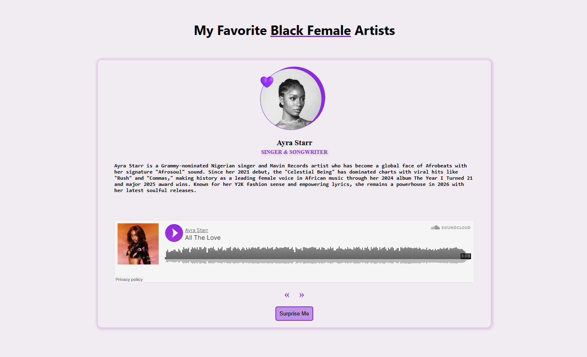

# 🎵 My Favorite Black Female Artists Slider

Hey there, music lovers! 🌟 Welcome to my super fun and heartfelt project celebrating some of the most incredible Black female artists who have been lighting up the music scene. As a huge music fan and a proud Black woman, I feel deeply empowered by women who look like me and the incredible impact they've made through their art. That's why I created this interactive slider – to share a little bit more about these amazing queens with the world!

## 🎯 What's This All About?

This project is a vibrant, interactive carousel that showcases profiles of eight phenomenal Black female artists. Each slide features their beautiful photo, name, profession, a detailed bio highlighting their achievements, style, and contributions to music, PLUS an embedded SoundCloud player so you can actually listen to one of their amazing tracks! Navigate through the artists using the arrow buttons or hit "Surprise Me" for a random pick – perfect for discovering new favorites or celebrating old ones!

## 🚀 How to Get Started

Getting this party started is as easy as pie! Just follow these simple steps:

1. **Clone or download** this project to your local machine
2. **Open the `index.html` file** in your favorite web browser
3. **Start exploring!** Use the left/right arrows to browse through artists, or click "Surprise Me" for a random selection

That's it! No fancy installations or dependencies needed – pure HTML, CSS, and JavaScript goodness.

## 🛠️ Tools & Technologies Used

This project was built with love using:

- **HTML5** - For the solid structure, semantic markup, and iframe embedding
- **CSS3** - For all the beautiful styling, responsive design, and that purple vibe ✨
- **Vanilla JavaScript** - For the interactive functionality and event handling
- **Event Listeners** - To make those navigation buttons come alive with click events
- **DOM Manipulation** - To dynamically update content as you navigate through artists
- **SoundCloud API** - For embedding playable music samples from each artist

The design is fully responsive, so it looks great on everything from your desktop to your phone!

## 💜 A Personal Note

Music has always been my biggest passion, and as a Black woman, I find immense inspiration and empowerment in the stories of Black female artists who have broken barriers, created movements, and touched millions of lives with their talent. These women aren't just musicians – they're trailblazers, entrepreneurs, and cultural icons who have paved the way for future generations.

This project is my way of saying "thank you" to these incredible women and sharing their stories with anyone who wants to learn more. Whether you're a longtime fan or just discovering their work, I hope this slider brings you as much joy as it brought me to create it!

## 📸 Preview

Check out how the slider looks in action:

## ⚠️ Important Note

Please note that I don't own the rights to the artist images used in this project. They're included here for educational and demonstrative purposes only. All artist information and descriptions are based on publicly available knowledge and achievements. The embedded SoundCloud players are also used for demonstration purposes and showcase publicly available tracks from each artist.

---

Made with 💜 and lots of good vibes! Feel free to explore, learn, and maybe even get inspired to create your own celebration of amazing artists. 🎶
